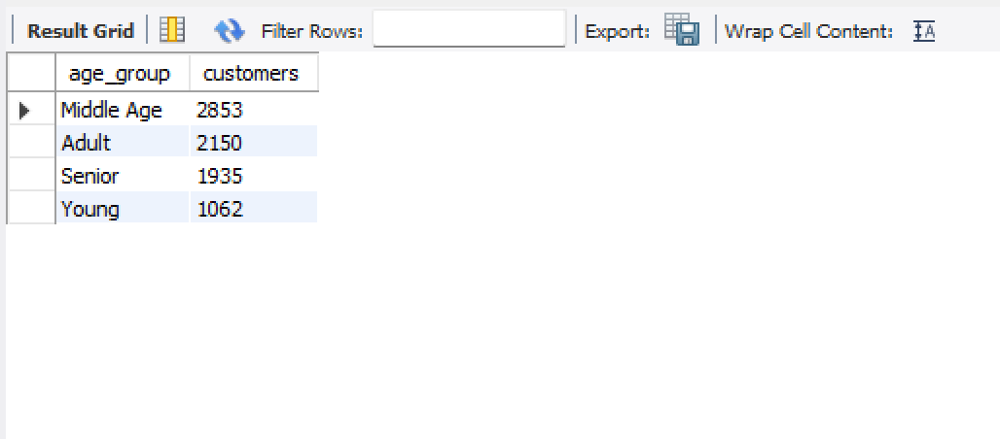
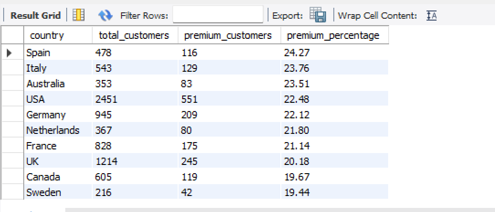
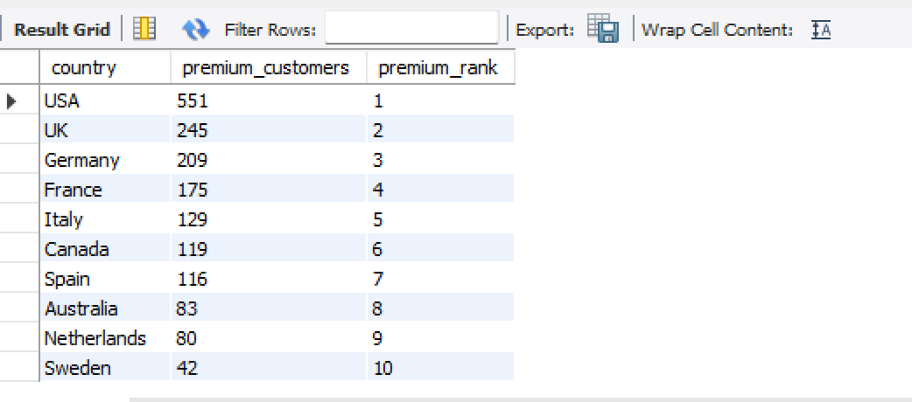
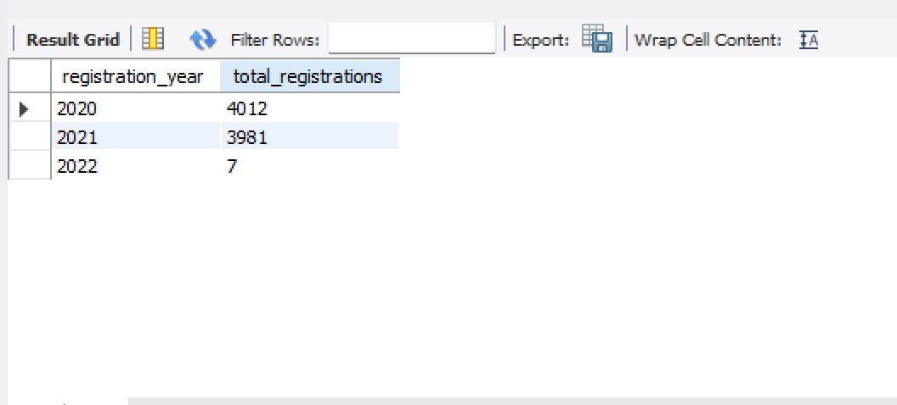

# Customer Behavior Analysis using SQL

## Project Overview

This project analyzes customer behavior data using SQL. The objective is to understand customer demographics, premium membership adoption, email verification status, customer segmentation, and registration trends.

## Dataset Information

* Total Records: 8,000
* Features: 11
* Source: Customer Dataset

## Business Questions

1. What is the total number of customers?
2. What is the gender distribution?
3. Which age group contains the most customers?
4. How many customers are premium?
5. Which countries have the largest customer base?
6. Which countries have the highest premium conversion?
7. What is the email verification rate by country?
8. What are the customer registration trends?

## SQL Skills Used

* SELECT
* WHERE
* GROUP BY
* ORDER BY
* Aggregate Functions
* CASE Statements
* Window Functions
* CTEs
* HAVING
* CAST
* Date Functions

## Key Insights

* Total customers: 8,000
* Largest age group: Middle Age (2,853 customers)
* Premium customers: 1,749
* USA has the highest premium customer count (551)
* Spain has the highest premium conversion rate (24.27%)
* Germany has the highest email verification rate (93.33%)

## Project Screenshots

## Project Structure

Dataset/
sql_queries/
Screenshots/
business_insights.md
README.md
